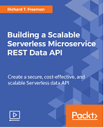

Copyright (c) 2017-2019 Starwolf Ltd and Richard Freeman. All Rights Reserved.

Licensed under the Apache License, Version 2.0 (the "License").
You may not use this file except in compliance with the License.
A copy of the License is located at http://www.apache.org/licenses/LICENSE-2.0 or in the "license" file accompanying this file. This file is distributed on an "AS IS" BASIS, WITHOUT WARRANTIES OR CONDITIONS OF ANY KIND, either express or implied. See the License for the specific language governing permissions and limitations under the License.

## Serverless Microservice Data API

In this repository, I share some sample code used to create a scalable serverless data API from my two video courses. It includes bash scripts that can be used to unit test, build, package, deploy, and run integration tests. The Python code is written defensively to deal with any API exception.

|For beginners and intermediates, the [full Serverless Data API](https://www.packtpub.com/application-development/building-scalable-serverless-microservice-rest-data-api-video) code, configuration and a detailed walk through |For intermediate or advanced users, I cover [15+ serverless microservice patterns](https://www.packtpub.com/application-development/implementing-serverless-microservices-architecture-patterns-video) with original content, code, configuration and detailed walk through |
|:----------|:-------------|
| [](https://www.packtpub.com/application-development/building-scalable-serverless-microservice-rest-data-api-video)|  [](https://www.packtpub.com/application-development/implementing-serverless-microservices-architecture-patterns-video) |


### 1. Windows Only

Please skip this step if you are not using Windows.

Using Bash (Unix Shell) makes your life much easier when deploying and managing you serverless stack. I think all analysts, data scientists, architects, administrators, database administrators, developers, DevOps and technical people should know some basic Bash and be able to run shell scripts, which are typically used on LINUX and UNIX (including macOS Terminal).

Alternatively you can adapt the scripts to use MS-DOS or Powershell but it's not something I recommended, given that Bash can now run natively on Windows 10 as an application, and there are many more examples online in Bash.

Note that I have stripped off the `\r` or carriage returns, as they are illegal in shell scripts, you can use something like [notepad++](https://notepad-plus-plus.org/) on Windows if you want to view the carriage returns in your files properly. If you use traditional Windows Notepad the new lines may not be rendered at all, so use [Notepad++](https://notepad-plus-plus.org/), [Sublime](https://www.sublimetext.com/), [Atom](https://atom.io/) or other such editors.

A detailed guide on how to install [Linux Bash shell on Windows 10 can be found here](https://www.howtogeek.com/249966/how-to-install-and-use-the-linux-bash-shell-on-windows-10/). The main steps are:
* Control Panel > Programs > Turn Windows Features On Or Off.
* Choose the check box next to the **Windows Subsystem for Linux** option in the list, and then Choose **OK**.
* Under **Microsoft Store > Run Linux on Windows** Select **Ubuntu**.
* Launch Ubuntu and setup a root account username and password
The Windows `C:\` and other dives are already mounted, and you can access them with the following command in the terminal:
```bash
$ cd /mnt/c/
```

Well done you now have full access to Linux on Windows!

### 2. Update Ubuntu, Install Git and Clone Repository
```bash
$ sudo apt-get update
$ sudo apt-get -y upgrade
$ apt-get install git-core
```
Clone the repository locally with a `git pull`

### 3. Install Python and Dependencies

The Lambda code is written in Python 3.6. Pip is a tool for installing and managing Python packages. Other popular Python package and dependency managers are available such as [Conda](https://conda.io/docs/index.html) or [Pipenv](https://pipenv.readthedocs.io) but we will be using pip as it is the recommended tool for installing packages from the Python Package Index [PyPI](https://pypi.org/) and most widely supported.

```bash
$ sudo apt -y install python3.6
$ sudo apt -y install python3-pip
```

Check the Python version
```bash
$ python3 --version
```
You should get the Python3.6+ version.

The dependent packages required for running, testing and deploying the severless microservices are listed in `requirements.txt` under each project folder, and can be installed using pip.
```bash
$ sudo pip3 install -r /path/to/requirements.txt
```
This will install the dependent libraries for local development such as [Boto3](https://boto3.amazonaws.com) which is the Python AWS Software Development Kit (SDK).

### 3. Install and Setup AWS CLI

AWS Command Line Interface is used to package and deploy your Lambda functions, as well as setup the infrastructure and security in a repeatable way.

```bash
$ sudo pip install awscli --upgrade
```

You have created a user called `newuser` earlier and have a `crednetials.csv` with the AWS keys. Enter them them running `aws configure`.

```bash
$ aws configure
AWS Access Key ID: <the Access key ID from the csv>
AWS Secret Access Key: <the Secret access key from the csv>
Default region name: <your AWS region such as eu-west-1>
Default output format: <optional>
```

More details on setting up the AWS CLI is available [in the AWS Docs](https://docs.aws.amazon.com/lambda/latest/dg/setup-awscli.html).

For choosing your AWS Region refer to [AWS Regions and Endpoints](https://docs.aws.amazon.com/general/latest/gr/rande.html) generally those in the USA can use `us-east-1` and those in Europe can use `eu-west-1`

### 4. Update AccountId, Bucket and Profile
Here I assume your AWS profile is `demo` you can change that under `bash/apigateway-lambda-dynamodb/common-variables.sh`.
You will need to use a bucket or create one if you haven't already:
```bash
$ aws s3api create-bucket --bucket mynewbucket231 --profile demo --create-bucket-configuration Loc
ationConstraint=eu-west-1 --region eu-west-1

```
You will also need to change the AWS accountId (current set to 000000000000). The AWS accountId is also used in some IAM policies in the IAM folder. In addition the region will have to be changed.

to replace your accountId (assume your AWS accountId is 111111111111) you can do it manually or run:
```bash
find ./ -type f -exec sed -i '' -e 's/000000000000/111111111111/' {} \;
```

### 5. Run Unit Tests
Change directory to the main bash folder
```bash
$ cd bash/apigateway-lambda-dynamodb/
$ ./unit-test-lambda.sh
```

### 6. Build Package and Deploy the Serverless API
This also creates the IAM Polices and IAM Roles using the AWS CLI that will be required for the Lambda function.
```bash
$ ./build-package-deploy-lambda-dynamo-data-api.sh
```
In less than a minute you should have a stack. Otherwise look at the error messages, CloudFormation stack and ensure your credentials are setup correctly.

### 7. Run Lambda Integration Test
Once the stack is up and running, you can run an integration test to check that the Lambda is working.
```bash
./invoke-lambda.sh
```

### 8. Add data to DynamoDb table

Change to the DynamoDB Python directory and run the Python code, you can also run this under you favourite IDE like PyDev or PyCharm.
```bash
$ (cd ../../aws_dynamo; python dynamo_insert_items_from_file.py)
```

### 9. AWS Management Console
Now the stack is up you can have a look at the API Gateway in the AWS Management Console and test the API in your browser.
* API Gateway > lambda-dynamo-data-api
* Stages > Prod > Get
* Copy the Invoke URL into a new tab, e.g. https://XXXXXXXXXX.execute-api.eu-west-1.amazonaws.com/Prod/visits/{resourceId}
* You should get a message `resource_id not a number` as the ID is not valid
* Replace {resourceId} in the URL with 324
if all is working you should see some returned JSON records. Well done if so!

### 10. Deleting the stack
Go back to the main bash folder and delete the cloudFormation serverless stack.

```bash
$ ./delete-stack.sh
```
